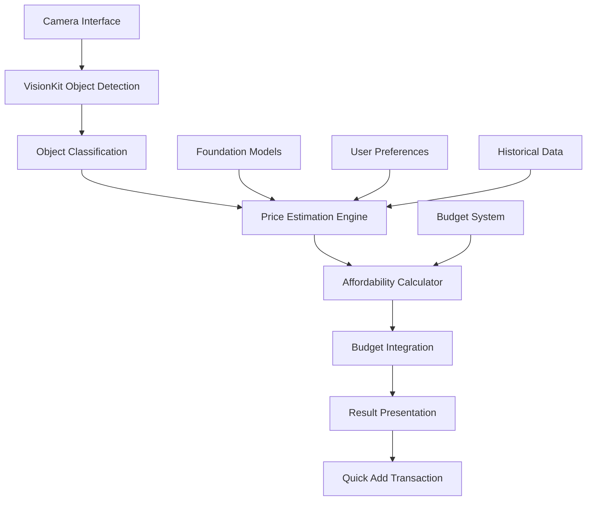

# Design Document

## Overview

The Camera Affordability Scanner is a sophisticated feature that combines computer vision, machine learning, and financial analysis to provide real-time purchase decision support. The system uses VisionKit for object recognition, Apple's Foundation Models for intelligent price estimation, and the existing budget system for affordability calculations. All processing occurs on-device to ensure complete privacy while delivering instant feedback through an intuitive camera interface.

## Architecture

### High-Level Architecture



### Component Architecture

The system follows MVVM architecture with specialized components:

- **CameraAffordabilityView**: Main SwiftUI view managing the camera interface
- **AffordabilityViewModel**: Coordinates between vision processing and budget calculations
- **VisionProcessor**: Handles object detection and classification using VisionKit
- **PriceEstimationEngine**: Uses Foundation Models for intelligent price prediction
- **AffordabilityCalculator**: Integrates with existing budget system for purchase decisions
- **ResultPresentation**: Manages the display of affordability results and user interactions

## Components and Interfaces

### 1. CameraAffordabilityView (SwiftUI View)

**Purpose**: Provides the main camera interface with real-time object detection and result display.

**Key Properties**:
- `@StateObject private var viewModel: AffordabilityViewModel`
- `@State private var showingResult: Bool = false`
- `@State private var detectedObject: DetectedObject?`
- `@State private var affordabilityResult: AffordabilityResult?`

**Key Methods**:
- `body: some View` - Main view composition with camera preview and overlay
- `handleObjectDetection(_:)` - Processes detected objects from vision system
- `presentAffordabilityResult(_:)` - Shows slide-up result card with haptic feedback

### 2. AffordabilityViewModel (ObservableObject)

**Purpose**: Central coordinator managing the flow from object detection to affordability calculation.

**Key Properties**:
- `@Published var isScanning: Bool = false`
- `@Published var currentResult: AffordabilityResult?`
- `@Published var confidenceLevel: Float = 0.0`
- `private let visionProcessor: VisionProcessor`
- `private let priceEngine: PriceEstimationEngine`
- `private let calculator: AffordabilityCalculator`

**Key Methods**:
- `startScanning()` - Initializes camera and vision processing
- `processDetectedObject(_:)` - Coordinates object analysis pipeline
- `calculateAffordability(for:)` - Determines purchase feasibility
- `addToBudget(_:)` - Integrates with existing transaction system

### 3. VisionProcessor (NSObject)

**Purpose**: Handles all computer vision tasks using VisionKit and Core ML.

**Key Properties**:
- `private var requests: [VNRequest]`
- `private let objectClassifier: VNCoreMLModel`
- `private var delegate: VisionProcessorDelegate?`

**Key Methods**:
- `detectObjects(in: CVPixelBuffer)` - Performs object detection on camera frames
- `classifyObject(_:)` - Determines object category and confidence
- `extractFeatures(_:)` - Extracts relevant features for price estimation

### 4. PriceEstimationEngine (Class)

**Purpose**: Estimates item prices using Foundation Models and historical data.

**Key Properties**:
- `private let foundationModel: MLModel`
- `private var priceHistory: [String: [PriceDataPoint]]`
- `private let categoryPriceRanges: [Category: PriceRange]`

**Key Methods**:
- `estimatePrice(for: DetectedObject)` - Generates price estimate with confidence
- `updatePriceModel(with: UserFeedback)` - Improves estimates based on user input
- `getCategoryPriceRange(_:)` - Returns typical price range for object category

### 5. AffordabilityCalculator (Class)

**Purpose**: Integrates price estimates with budget system to determine affordability.

**Key Properties**:
- `private let budgetViewModel: BudgetViewModel`
- `private var affordabilityThresholds: AffordabilityThresholds`

**Key Methods**:
- `calculateAffordability(price: Double, category: Category)` - Main affordability logic
- `assessBudgetImpact(_:)` - Determines effect on monthly and daily budgets
- `generateRecommendations(_:)` - Provides purchase timing and alternatives
- `checkSpendingStreak(_:)` - Evaluates impact on spending streak

## Data Models

### DetectedObject
```swift
struct DetectedObject {
    let id: UUID
    let category: ObjectCategory
    let confidence: Float
    let boundingBox: CGRect
    let features: [String: Any]
    let timestamp: Date
}
```

### AffordabilityResult
```swift
struct AffordabilityResult {
    let canAfford: Bool
    let estimatedPrice: PriceEstimate
    let budgetImpact: BudgetImpact
    let recommendations: [Recommendation]
    let confidence: Float
    let reasoning: String
}
```

### PriceEstimate
```swift
struct PriceEstimate {
    let amount: Double
    let range: ClosedRange<Double>
    let confidence: Float
    let category: Category
    let source: EstimationSource
}
```

### BudgetImpact
```swift
struct BudgetImpact {
    let remainingMonthlyBudget: Double
    let categoryBudgetRemaining: Double
    let dailyBudgetImpact: Double
    let streakRisk: StreakRisk
    let alternativeTimings: [PurchaseTiming]
}
```

## Error Handling

### Vision Processing Errors
- **Camera Access Denied**: Graceful fallback with permission request
- **Object Detection Failure**: Retry mechanism with user guidance
- **Low Confidence Detection**: Clear indication and suggestion for better positioning

### Price Estimation Errors
- **Model Loading Failure**: Fallback to category-based estimates
- **Network Unavailable**: Fully offline operation with cached data
- **Insufficient Training Data**: Conservative estimates with clear uncertainty indication

### Budget Integration Errors
- **Data Corruption**: Safe fallback to default budget values
- **Calculation Overflow**: Proper bounds checking and error messages
- **Sync Issues**: Queue-based processing with retry logic

## Testing Strategy

### Unit Testing
- **VisionProcessor**: Mock camera inputs with known objects
- **PriceEstimationEngine**: Test with various object categories and price ranges
- **AffordabilityCalculator**: Verify calculations with different budget scenarios
- **Data Models**: Validate serialization and edge cases

### Integration Testing
- **Camera to Vision Pipeline**: End-to-end object detection flow
- **Vision to Price Estimation**: Verify object classification accuracy
- **Price to Affordability**: Test budget integration scenarios
- **Result Presentation**: UI state management and user interactions

### Performance Testing
- **Real-time Processing**: Ensure <2 second response time
- **Memory Usage**: Monitor for leaks during extended camera use
- **Battery Impact**: Optimize for minimal power consumption
- **Model Loading**: Test cold start and warm-up scenarios

### User Experience Testing
- **Accessibility**: VoiceOver support and dynamic type compatibility
- **Different Lighting**: Test recognition accuracy in various conditions
- **Object Variety**: Validate performance across different item categories
- **Error Recovery**: Ensure graceful handling of edge cases

## Privacy and Security

### On-Device Processing
- All image analysis performed locally using VisionKit
- Foundation Models run entirely on-device
- No image data transmitted to external servers
- Immediate memory cleanup after processing

### Data Protection
- Temporary image buffers cleared after each frame
- Price estimation models use differential privacy
- User feedback encrypted using CryptoKit
- No persistent storage of camera data

### Permissions
- Camera access requested with clear explanation
- Graceful degradation when permissions denied
- User control over feature availability
- Transparent privacy policy integration

## Performance Considerations

### Real-time Processing
- Optimized Core ML models for mobile inference
- Frame rate throttling to balance accuracy and performance
- Background processing queues for non-UI operations
- Efficient memory management for continuous camera operation

### Model Optimization
- Quantized models for reduced memory footprint
- Lazy loading of ML models to improve startup time
- Caching of frequently detected object categories
- Progressive enhancement based on device capabilities

### Battery Optimization
- Adaptive frame processing based on battery level
- Automatic pause during low power mode
- Efficient use of GPU resources for vision tasks
- Background app refresh optimization