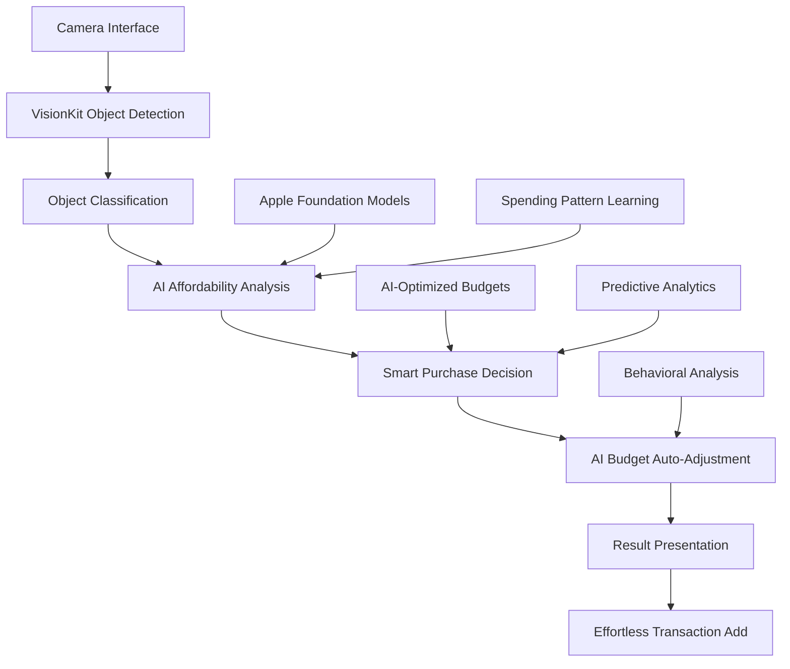

# Design Document

## Overview

The Camera Affordability Scanner is the flagship feature of Penny, embodying the "Point, Ask, Budget Smart" value proposition and the core mission to **eliminate traditional budgeting friction through AI automation**. This revolutionary feature combines VisionKit for real-time object recognition with Apple Foundation Models to provide instant yes/no purchase decisions against **AI-optimized budgets** that automatically adjust based on user behavior. 

Unlike traditional budgeting apps with fixed categories, Penny's AI continuously learns spending patterns and redistributes budget allocations intelligently. The Camera Scanner leverages this AI intelligence to provide contextual affordability decisions that consider not just current balances, but predictive spending analysis, behavioral patterns, and optimal purchase timing - all processed on-device for complete privacy.

## Architecture

### High-Level Architecture



### Component Architecture

The system follows MVVM architecture with AI-first specialized components:

- **CameraAffordabilityView**: Full-screen VisionKit interface with real-time object recognition
- **AIAffordabilityViewModel**: Coordinates Apple Foundation Models with zero-friction budget management
- **VisionProcessor**: Handles object detection and classification using VisionKit
- **AIBudgetIntelligence**: Uses Foundation Models for behavioral analysis and automatic budget redistribution
- **SmartAffordabilityEngine**: Provides contextual purchase decisions based on AI-optimized budgets
- **EffortlessIntegration**: Seamless transaction addition with Apple Pay-style UX

## Design System

### Visual Design System

Following Penny's neo-brutalist minimalism with premium feel:

**Colors**:
- **Affordable Items**: Success Green (#34C759) with subtle glow effect
- **Unaffordable Items**: System Red with clear warning indicators  
- **Camera Interface**: Pure White backgrounds with Electric Blue (#007AFF) accents
- **Result Cards**: Sophisticated blur effects with high contrast typography

**Typography**:
- **Headers**: SF Pro Display for camera interface elements
- **Financial Numbers**: SF Mono for price displays and budget impact
- **Body Text**: SF Pro Text for affordability explanations

**Interactions**:
- **Haptic Feedback**: Subtle feedback on object detection and result presentation
- **Spring Animations**: Smooth slide-up result cards with spring physics
- **Micro-interactions**: Pulse effects on successful object recognition

### UX Principles

- **Information Hierarchy**: Affordability decision > Price estimate > Budget impact > Recommendations
- **One-Handed Usage**: Camera controls and primary actions within thumb reach
- **Cognitive Load**: Maximum 2 primary actions per screen (Scan/Add to Budget)
- **Progressive Disclosure**: Detailed budget impact hidden in expandable result card

## Components and Interfaces

### 1. CameraAffordabilityView (SwiftUI View)

**Purpose**: Provides the full-screen VisionKit camera interface with real-time object recognition and color-coded feedback system.

**Key Properties**:
- `@StateObject private var viewModel: AffordabilityViewModel`
- `@State private var showingResultCard: Bool = false`
- `@State private var detectedObject: DetectedObject?`
- `@State private var affordabilityResult: AffordabilityResult?`
- `@State private var cameraPermissionGranted: Bool = false`

**Key Methods**:
- `body: some View` - Full-screen camera interface with overlay elements
- `handleObjectDetection(_:)` - Processes detected objects with haptic feedback
- `presentSlideUpResultCard(_:)` - Shows sophisticated slide-up result card
- `showColorCodedFeedback(_:)` - Displays green/red affordability indicators
- `handleQuickAddToBudget()` - Integrates with existing transaction system

### 2. AIAffordabilityViewModel (ObservableObject)

**Purpose**: Central AI coordinator that eliminates traditional budgeting friction by automatically managing spending limits and providing intelligent affordability decisions.

**Key Properties**:
- `@Published var isScanning: Bool = false`
- `@Published var aiAffordabilityResult: AIAffordabilityResult?`
- `@Published var aiConfidence: Float = 0.0`
- `private let budgetViewModel: BudgetViewModel` // Integration with existing system
- `private let visionProcessor: VisionProcessor`
- `private let aiBudgetIntelligence: AIBudgetIntelligence`
- `private let smartAffordabilityEngine: SmartAffordabilityEngine`

**Key Methods**:
- `startAIScanning()` - Initializes VisionKit camera and Apple Foundation Models
- `processWithAI(_:)` - Coordinates AI analysis with behavioral learning
- `getInstantAIDecision(for:)` - Zero-friction yes/no decision with AI reasoning
- `autoAdjustBudgetsBasedOnDecision(_:)` - AI automatically redistributes spending limits
- `addToTrackingEffortlessly(_:)` - Apple Pay-style seamless transaction integration

### 3. VisionProcessor (NSObject)

**Purpose**: Handles all computer vision tasks using VisionKit and Core ML.

**Key Properties**:
- `private var requests: [VNRequest]`
- `private let objectClassifier: VNCoreMLModel`
- `private var delegate: VisionProcessorDelegate?`

**Key Methods**:
- `detectObjects(in: CVPixelBuffer)` - Performs object detection on camera frames
- `classifyObject(_:)` - Determines object category and confidence
- `extractFeatures(_:)` - Extracts relevant features for price estimation

### 4. AIBudgetIntelligence (Class)

**Purpose**: Core AI engine using Apple Foundation Models to eliminate traditional budgeting friction through automatic spending limit adjustments and behavioral analysis.

**Key Properties**:
- `private let foundationModel: MLModel` // Apple Foundation Model for on-device AI
- `private var behavioralLearningEngine: BehavioralLearningEngine`
- `private var aiOptimizedBudgets: [Category: AIBudgetAllocation]`
- `private var spendingPatternPredictor: SpendingPatternPredictor`
- `private var contextualIntelligence: ContextualIntelligence`

**Key Methods**:
- `analyzeSpendingPatternsWithAI()` - Continuous behavioral analysis and learning
- `autoRedistributeBudgets()` - AI automatically adjusts spending limits based on behavior
- `predictOptimalAffordability(for: DetectedObject)` - AI-powered purchase decision with reasoning
- `generateSmartNotifications()` - Intelligent alerts for unusual spending patterns
- `processNaturalLanguageExpense(_:)` - Natural language expense processing and categorization

### 5. SmartAffordabilityEngine (Class)

**Purpose**: Provides intelligent affordability decisions that go beyond traditional budget checking by incorporating AI predictions, behavioral patterns, and contextual recommendations.

**Key Properties**:
- `private let budgetViewModel: BudgetViewModel` // Integration with existing system
- `private var aiOptimizedBudgets: [Category: AIBudgetAllocation]` // Dynamic AI-managed limits
- `private let streakProtectionAI: StreakProtectionAI` // AI-powered streak maintenance
- `private var predictiveSpendingAnalysis: PredictiveSpendingAnalysis`

**Key Methods**:
- `getSmartAffordabilityDecision(aiAnalysis: AIAnalysis)` - Contextual yes/no with AI reasoning
- `assessPredictiveImpact(_:)` - Analyzes future spending implications using AI
- `maintainAIAdjustedStreak(_:)` - Protects gamified streak with intelligent recommendations
- `generateContextualAlternatives(_:)` - AI suggests optimal purchase timing and alternatives
- `updateBehavioralModel(with: PurchaseDecision)` - Continuous learning from user choices

## Data Models

### DetectedObject
```swift
struct DetectedObject {
    let id: UUID
    let category: ObjectCategory
    let confidence: Float
    let boundingBox: CGRect
    let aiFeatures: [String: Any] // AI-extracted contextual features
    let timestamp: Date
}
```

### AIAffordabilityResult
```swift
struct AIAffordabilityResult {
    let canAfford: Bool
    let aiReasoning: String // Natural language explanation from Foundation Models
    let estimatedPrice: AIEstimate
    let smartBudgetImpact: SmartBudgetImpact
    let contextualRecommendations: [AIRecommendation]
    let aiConfidence: Float
    let behavioralInsights: BehavioralInsights
}
```

### AIBudgetAllocation
```swift
struct AIBudgetAllocation {
    let category: Category
    let aiOptimizedLimit: Double // AI-adjusted spending limit
    let behavioralTrend: SpendingTrend
    let predictedUsage: Double
    let autoAdjustmentReason: String
    let lastAIUpdate: Date
}
```

### BehavioralInsights
```swift
struct BehavioralInsights {
    let spendingPattern: SpendingPattern
    let optimalPurchaseTiming: PurchaseTiming
    let alternativeSuggestions: [AlternativeSuggestion]
    let streakImpactPrediction: StreakImpactPrediction
    let aiLearningConfidence: Float
}
```

### PriceEstimate
```swift
struct PriceEstimate {
    let amount: Double
    let range: ClosedRange<Double>
    let confidence: Float
    let category: Category
    let source: EstimationSource
}
```

### BudgetImpact
```swift
struct BudgetImpact {
    let remainingMonthlyBudget: Double
    let categoryBudgetRemaining: Double
    let dailyBudgetImpact: Double
    let streakRisk: StreakRisk
    let alternativeTimings: [PurchaseTiming]
}
```

## Error Handling

### Vision Processing Errors
- **Camera Access Denied**: Graceful fallback with permission request
- **Object Detection Failure**: Retry mechanism with user guidance
- **Low Confidence Detection**: Clear indication and suggestion for better positioning

### Price Estimation Errors
- **Model Loading Failure**: Fallback to category-based estimates
- **Network Unavailable**: Fully offline operation with cached data
- **Insufficient Training Data**: Conservative estimates with clear uncertainty indication

### Budget Integration Errors
- **Data Corruption**: Safe fallback to default budget values
- **Calculation Overflow**: Proper bounds checking and error messages
- **Sync Issues**: Queue-based processing with retry logic

## Testing Strategy

### Unit Testing
- **VisionProcessor**: Mock camera inputs with known objects
- **PriceEstimationEngine**: Test with various object categories and price ranges
- **AffordabilityCalculator**: Verify calculations with different budget scenarios
- **Data Models**: Validate serialization and edge cases

### Integration Testing
- **Camera to Affordability Pipeline**: End-to-end object detection and purchase decision flow
- **Vision to Price Estimation**: Verify object classification accuracy
- **Price to Affordability**: Test budget integration scenarios
- **Result Presentation**: UI state management and user interactions

### Performance Testing
- **Real-time Processing**: Ensure <2 second response time
- **Memory Usage**: Monitor for leaks during extended camera use
- **Battery Impact**: Optimize for minimal power consumption
- **Model Loading**: Test cold start and warm-up scenarios

### User Experience Testing
- **Accessibility**: VoiceOver support and dynamic type compatibility
- **Different Lighting**: Test recognition accuracy in various conditions
- **Object Variety**: Validate performance across different item categories
- **Error Recovery**: Ensure graceful handling of edge cases

## Privacy and Security

### Privacy-First Architecture
- **Apple Foundation Models**: All AI processing happens on-device ensuring financial data never leaves the iPhone
- **VisionKit Integration**: Object recognition performed locally without cloud dependency
- **Zero Network Dependency**: Complete functionality without internet connection
- **Secure Enclave Integration**: Biometric authentication for sensitive operations

### Data Protection
- **Immediate Memory Cleanup**: Camera frames and image buffers cleared after each processing cycle
- **CryptoKit Encryption**: All user preferences and learning data encrypted at rest
- **No Persistent Camera Data**: Zero storage of images or camera-related information
- **Differential Privacy**: AI model updates use privacy-preserving techniques

### Permissions and User Control
- **Transparent Camera Access**: Clear explanation of camera usage for affordability scanning
- **Graceful Degradation**: Full app functionality maintained when camera access denied
- **User Privacy Controls**: Toggle to disable AI learning and data collection
- **Face ID Integration**: Optional biometric protection for camera feature access

## Performance Considerations

### Real-time Processing
- Optimized Core ML models for mobile inference
- Frame rate throttling to balance accuracy and performance
- Background processing queues for non-UI operations
- Efficient memory management for continuous camera operation

### Model Optimization
- Quantized models for reduced memory footprint
- Lazy loading of ML models to improve startup time
- Caching of frequently detected object categories
- Progressive enhancement based on device capabilities

### Battery Optimization
- Adaptive frame processing based on battery level
- Automatic pause during low power mode
- Efficient use of GPU resources for vision tasks
- Background app refresh optimization